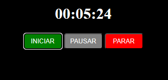

<h1 align="center">Timer</h1>

Programa criado e desenvolvido por Lucas Aguiar.

 

  

## 🚀 Tecnologias

Esse projeto foi desenvolvido com as seguintes tecnologias:

- HTML e CSS
- JavaScript
- Git e Github

## 💻 Projeto

O Timer foi desenvolvido para aprimorar técnicas e conhecimento.
